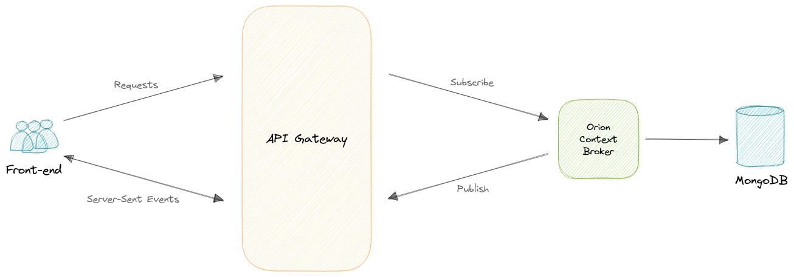

# Joe's Traffic

A distributed traffic monitoring web application with IoT premisses, implemented with Orion Context Broker, Spring WebFlux, React and Leaflet.js

## API Gateway endpoints

### Get all sensors

GET /sensors

### Register new sensor

POST /sensors

### Update sensor state

PATCH /sensors/{id}

### Subscribe to all sensors

GET /sensors/events

### Publish sensor update

POST /sensors/events
